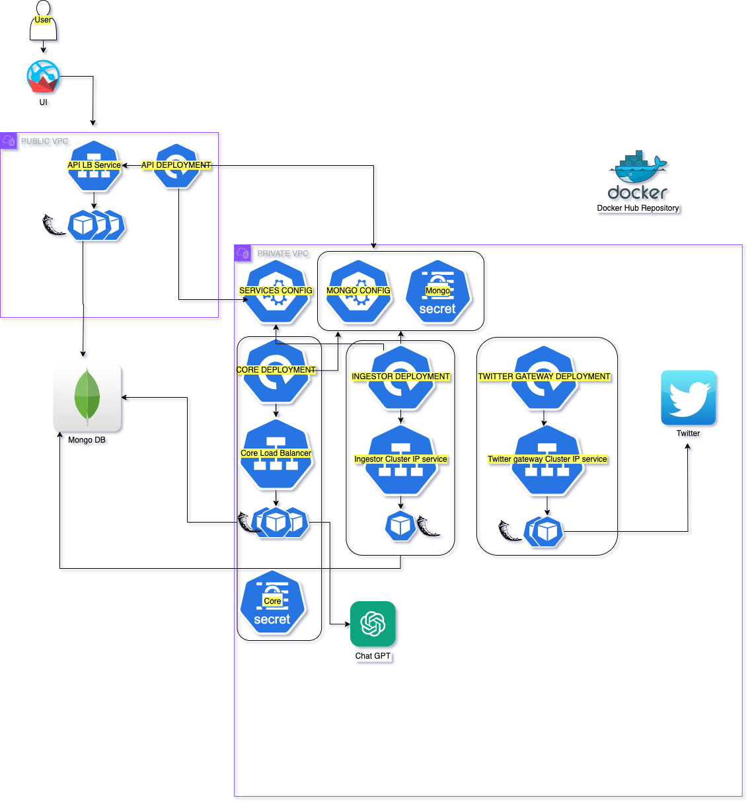
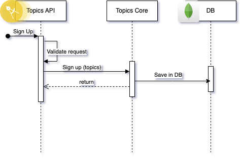
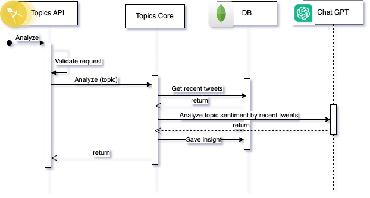
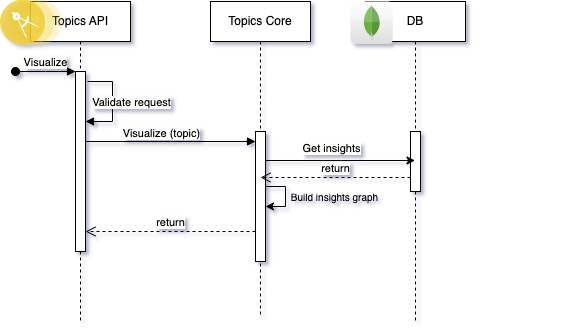
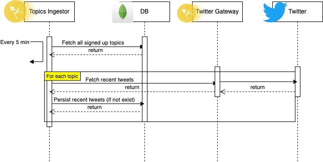
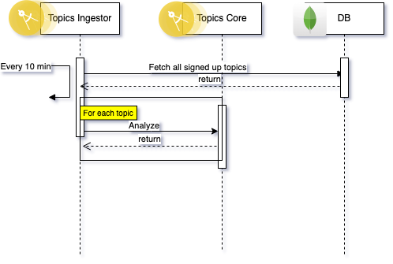

# topics-insights

Application to get the most recent insights about your topics of interest.
This repository contains all the services to run the application.
cd to the right directory and run the following command to install the dependencies:

``` pip install -r requirements.txt```

## Topics Insights

## How to create a Kubernetes cluster with all component **locally**?

### Prerequisites
1. Install Docker
2. Install Minikube (and kubectl)

### Steps
1. Start Docker Desktop
2. Start minikube
```minikube start```
3. Create the kubernetes components by using kubectl command
```bash
kubectl apply -f k8s/mongo-config.yaml
kubectl apply -f k8s/mongo-secret.yaml
kubectl apply -f k8s/services-config.yaml
kubectl apply -f topics-analyzer-api/topics-api.yaml
kubectl apply -f topics-core/core-secret.yaml
kubectl apply -f topics-core/topics-core.yaml
kubectl apply -f topics-ingestor/topics-ingestor.yaml
kubectl apply -f topics-twitter-gateway/twitter-gateway.yaml
```
4. Verify all pods are running
```bash
kubectl get pods
```

5. Run the UI locally if needed:
```bash
cd topics-ui
TOPICS_API_HOST=http://localhost:2345 streamlit run streamlit_app.py
```

### topics-ui
This is the user interface of the application. It is responsible to get the request from the user and send it to the topics-analyzer-api to sign up, to get the insights about the topics of interest or to visualize it.

### topics-analyzer-api
This microservice is responsible to get REST request from users and represent our external layer which is open to get network traffic from the public internet.

**It is allowing registration of new topics in the system and getting insights about them.**
**It is also responsible to get the request from the user and send it to the topics-analyzer service to get the insights about the topics of interest.**

### topics-core

This microservice is responsible for most of the business logic of the application. It is responsible to get the request from the topics-analyzer-api. It can get network traffic only from the topics-insight system and cannot be reached by the PUBLIC network.

### topics-ingestor

This microservice is responsible to get the data from the external sources and persist it in the database. It can get network traffic only from the topics-insight system and cannot be reached by the PUBLIC network.

### topics-twitter-gateway

This microservice is responsible to read tweets from the Twitter API and send it to the topics-ingestor to persist it in the database. It can get network traffic only from the topics-insight system and cannot be reached by the PUBLIC network.

### topics-db-client

This library is responsible to connect to the database and get the data from it or persist it in it. 

# Diagrams

## K8s architecture


## Sign Up Flow


## Analyze Flow


## Visualize Flow


## Ingestor - Ingest Tweets Flow


## Ingestor - Ingest Insights Flow



